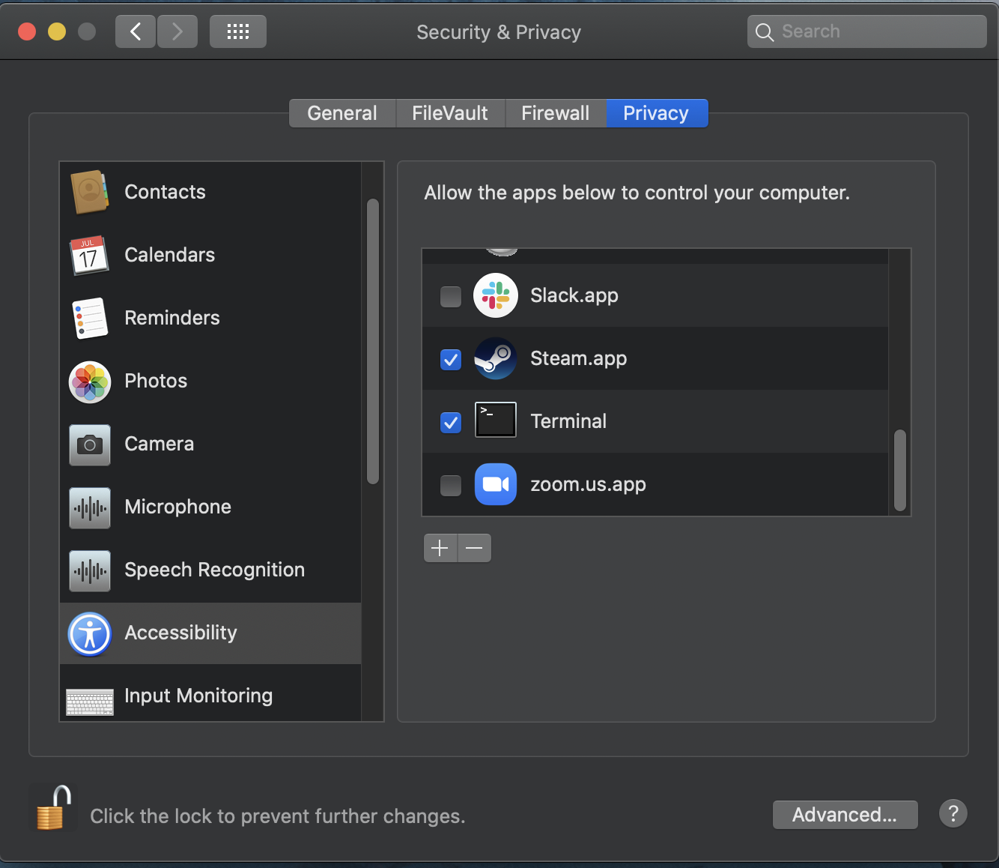
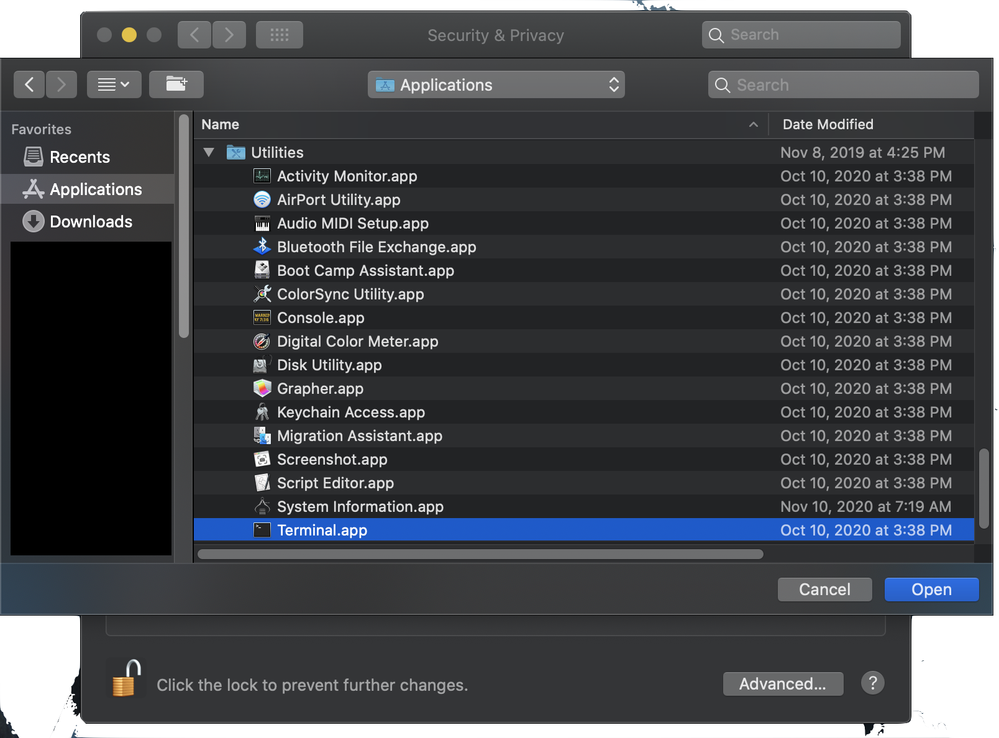

# Accessibility

1. Launch System Preferences
2. Select Security & Privacy
3. Select Privacy Tab
4. Click unlock at bottom of panel
4. Select Accessibility

    

5. Click [+] 
6. Select Applications -> Utilities -> Terminal

    
    
7. Click Ok
8. Make sure Terminal is checked
